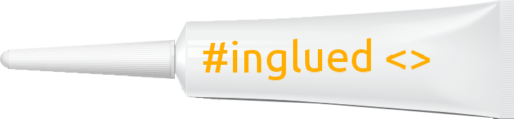
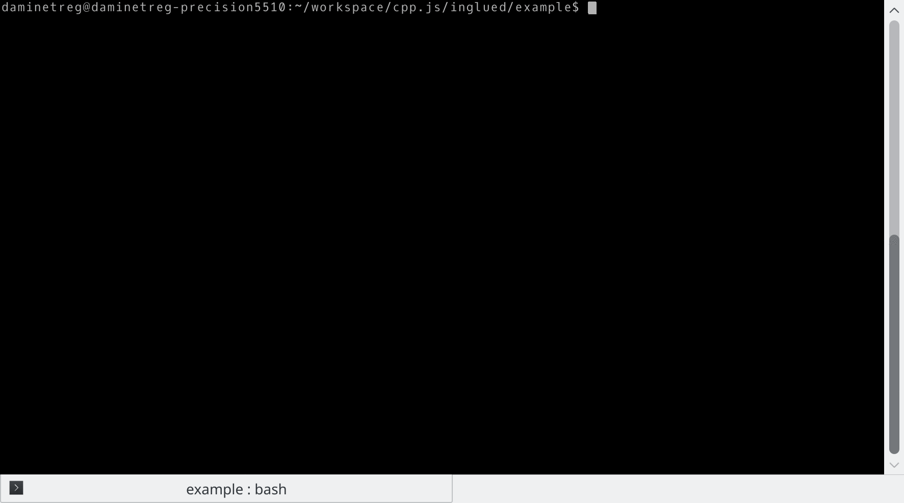

# `#inglued <>` : erasing c++ dependencies.
As a library author you have to ensure your library can be used easily. 

The problem is that your users might get an hard time to consume your C++ library, if you do depend on some other library yourself.

Dependency management is hard in C++ because there are :
  - so much target platform
  - so much build systems (cmake, visual studio, scons, autotools, bjam, waf, gyp,...)
  - so much kind of users

Your library will be consumed by two different kind of users :
  - The app developer that just copy/paste your code in his project
  - The system builder which wants clean sysroot and good transitive CMake package dependency.

## Yet another dependency-manager ? NO!
Definitely not, this is only glue to ease the shipping of your header-only library. The goal of this tool is to be **hidden to library users**, only library authors see it.

It automates and ease the version upgrade of your dependencies, but application code author shouldn't bother, they will just reuse.

## Yet another dependency store ?
No, we give you access to any [github.com](https://github.com/) which is the largest dependency store out there. But you can giveu us any git clone url as well.

# We make the app developer and the system packager happy
Here is a solution to provide your library easily to your users, **without needing** your users to install **yet another tool**.

  - **Either** directly by copy/paste in user project
  - **Or** integration via installation in sysroot
    * CMake Package Config for the CMake freaks
    * CMake build files for the system packager.


# How does it work ?
It simply provides you with a way to package **dependencies** inside **your git repository**. 

And the best, is that it doesn't use the cumbersome **submodules**, but the marvelous **subtree**.

Users just need to include your library folder. The rest is done by you using `#inglued <>`.

## Adding a library in 2 steps

  1. Add a new file `deps/glue` : 
 
```json
{
    "header-only/example-dependency"    : { "@" : "master" }
  , "cpp-pre/type_traits"               : { "@" : "develop" }
}
```


  2. Run `glue seal`, and :boom: you can tag your lib let user download it via [Github Releases](https://help.github.com/articles/creating-releases/).

### Explanation


[We only support header-only dependencies](doc/rationale/WHY_HEADER_ONLY.md), any other kind of libraries have to disappear.

Taking the example of [your-lib](https://github.com/header-only/example-your-lib): imagine you made a library and you want someone to use it.

What is sad is that you used other libraries to build your one :

  * [cpp-pre::type\_traits](https://github.com/cpp-pre/type_traits/) to analyze lambda signatures
  * Another library, that say is [example-dependency](https://github.com/header-only/example-dependency)

So as it's not dependency free, it would require you to ask your users to install dependencies first. But this is a real pain, it is the best way to make your users flee.

We've created `#inglued <>` to solve this. :wink:

## Why not just copying the Headers in my code ?

  - Via `#inglued <>` and it's the git-subtree you can easily bump version of your dependencies.
  - You can adapt to the folder hierarchy of the dependency via glue
  - Your users have the choice : 
    * You can ship your library for users that just include your folder
    * **OR** you can use the generated CMakeLists.txt to be a first-class citizen for system packager like yocto, ptxdist, debian...

## For more information on future development
See our [ROADMAP](./ROADMAP.md)

## License
You don't bother as what this tool do will not have impact on your code, but in case : [Boost Software License](./LICENSE).

Please give copyright notice for this project if you find it good.

```
Copyright (c) 2017 Damien Buhl alias daminetreg (damien.buhl@lecbna.org)
```
